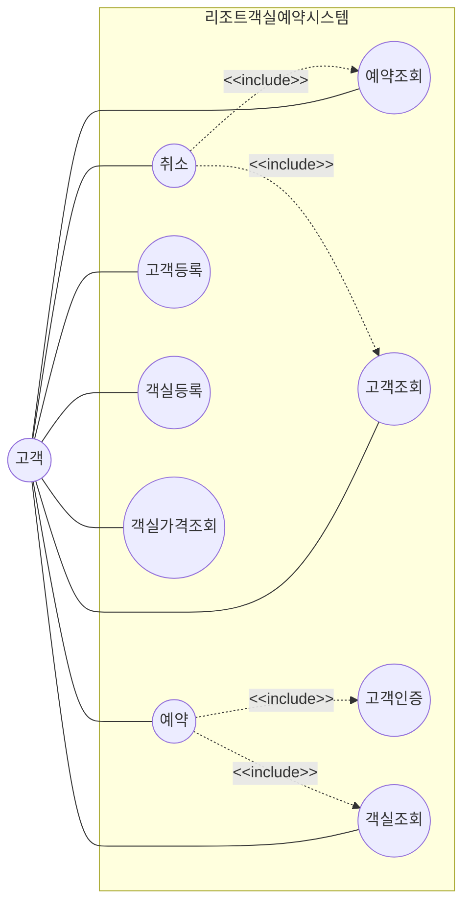

```mermaid
graph LR
    고객((고객))
 
    subgraph 리조트객실예약시스템
        UC1((예약))
        UC2((취소))
        UC3((예약조회))
        UC4((고객등록))
        UC5((고객조회))
        UC6((고객인증))
        UC7((객실등록))
        UC8((객실조회))
        UC9((객실가격조회))
    end
 
    고객 --- UC1
    고객 --- UC2
    고객 --- UC3
    고객 --- UC4
    고객 --- UC5
    고객 --- UC7
    고객 --- UC8
    고객 --- UC9
 
    UC1 -. "&lt;&lt;include&gt;&gt;" .-> UC6
    UC1 -. "&lt;&lt;include&gt;&gt;" .-> UC8
    UC2 -. "&lt;&lt;include&gt;&gt;" .-> UC3
    UC2 -. "&lt;&lt;include&gt;&gt;" .-> UC5
```